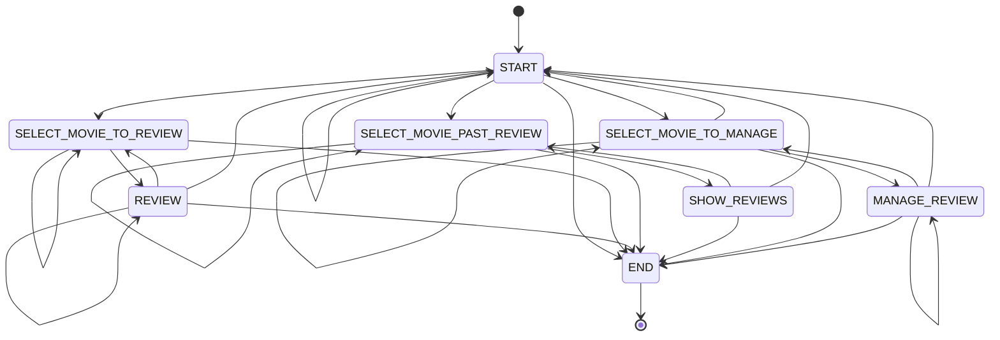

# Movie Review FSM

A finite state machine driving an LLM dialogue agent with structured JSON outputs.

## Running

```bash
uv sync --extra exercises
uv run python main.py --api-key sk-...
```

The API key can also be set via `OPENAI_API_KEY` or a `.env` file. Choose an alternative model with `--model`. Type `quit` or press Ctrl+C to exit. Saved reviews are stored in `reviews.json`.

## State Diagram



## Structure

- `models.py`: Pydantic models (`Movie`, `Review`, `ManageAction`) constraining LLM responses.
- `states.py`: Finite state machine transitions and conversational state handlers.
- `storage.py`: Review persistence in `reviews.json`.
- `main.py`: Interactive CLI runner and client configuration.
