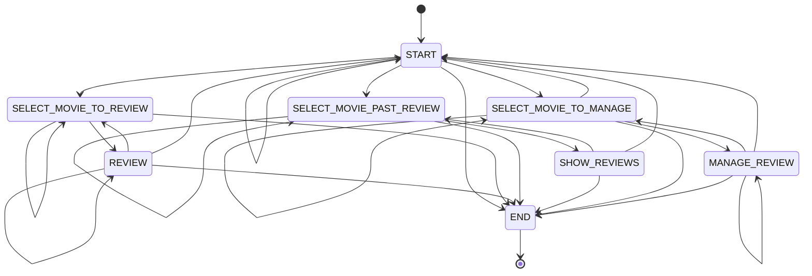

# Movie review FSM

A finite state machine driving an LLM agent. Each state carries a prompt, a
set of declared transitions and, where it collects structured data, a pydantic
response model. The model chooses the transition; the code decides what the
transition does.

## Running

```bash
uv sync --extra exercises
uv run python main.py --api-key sk-...
```

The key can also come from `OPENAI_API_KEY` in the environment or in `.env` at the
project root; `--api-key` wins over both. `--model` picks the OpenAI model.

Type `quit` or `exit`, or press Ctrl-C, to end the conversation.

Reviews are stored in `reviews.json` beside this file, one per film — a second
review of the same film replaces the first. The file is not tracked in git.

## Tests

```bash
uv run pytest . -v
```

The state handlers need a live model and are not unit tested. The validation,
the persistence and the pure helpers are.

## States



## Layout

| File | Role |
|---|---|
| `models.py` | `Movie`, `Review`, `ManageAction` — the structured responses, with their constraints |
| `storage.py` | JSON persistence for reviews |
| `states.py` | The machine and its state handlers |
| `main.py` | Client setup and the conversation loop |
